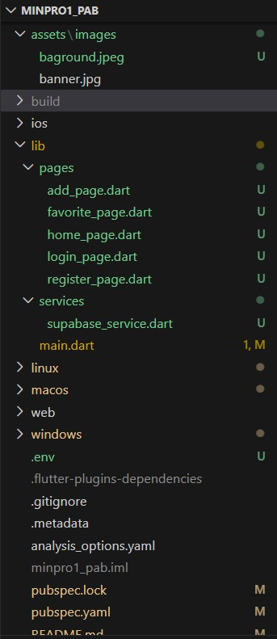

# <h1 align="center"> 𝑪𝒂𝒍𝒎é𝒓𝒂🌸 </h1>

────────── ✿ ──────────

  𝚂𝚖𝚊𝚛𝚝 𝚠𝚊𝚢 𝚝𝚘 𝚞𝚗𝚍𝚎𝚛𝚜𝚝𝚊𝚗𝚍 𝚢𝚘𝚞𝚛 𝚜𝚔𝚒𝚗 𝚓𝚘𝚞𝚛𝚗𝚎𝚢 🌸

 

  
  
  

────────── ✿ ──────────

---

## 
| Keterangan | Detail |
|------------|--------|
| **Nama**   | Zelsya Rizqita Rahmadhini |
| **NIM**    | 2409116022 |
| **Kelas**  | A'24 Sistem Informasi|

---

## Deskripsi Aplikasi

Calmera adalah aplikasi sederhana yang dikembangkan untuk membantu pengguna mengelola dan memantau penggunaan produk skincare secara lebih teratur dan terorganisir. Aplikasi ini dirancang sebagai solusi praktis bagi pengguna yang ingin memahami dan mengatur perjalanan perawatan kulitnya dengan lebih baik. Melalui Calmera, pengguna dapat mencatat nama produk, jenis produk, serta cara pemakaian atau catatan penting lainnya dalam satu tempat yang mudah diakses dan diperbarui. Dengan fitur pengelolaan data yang lengkap, aplikasi ini membantu pengguna menghindari kebingungan dalam penggunaan produk, menjaga konsistensi rutinitas, serta memahami perkembangan perawatan kulit secara lebih terstruktur.

Selain sebagai media pencatatan skincare, aplikasi ini juga menjadi implementasi konsep dasar pengembangan aplikasi mobile, seperti pengelolaan state, navigasi antar halaman, serta operasi CRUD (Create, Read, Update, Delete).

---
## Tujuan Pembuatan Aplikasi

Aplikasi Calmera dibuat untuk membantu pengguna mencatat dan mengelola produk skincare secara praktis dan terorganisir. Melalui aplikasi ini, pengguna dapat menyimpan informasi penting seperti nama produk, jenis, dan cara pemakaian dalam satu tempat yang mudah diakses dan diperbarui. Aplikasi ini dapat diterapkan dalam kehidupan sehari-hari, terutama bagi pengguna skincare yang ingin mengatur rutinitas perawatan kulit dengan lebih terstruktur dan tidak mudah lupa.

---

---

## Widget yang Digunakan

Berikut adalah widget utama yang digunakan dalam pengembangan aplikasi **Calmera**:

| No | Widget | Fungsi |
|----|--------|-----------------------|
| 1 | MaterialApp | Root aplikasi untuk mengatur tema dan konfigurasi dasar. |
| 2 | Scaffold | Struktur dasar halaman seperti body dan floating button. |
| 3 | AppBar | Header pada halaman Add/Edit. |
| 4 | Column | Menyusun widget secara vertikal. |
| 5 | Row | Menyusun elemen secara horizontal. |
| 6 | Expanded | Mengatur pembagian ruang antar widget. |
| 7 | ListView.builder | Menampilkan daftar produk secara dinamis. |
| 8 | Container | Membungkus dan mendesain elemen UI. |
| 9 | Text | Menampilkan teks pada aplikasi. |
|10 | TextField | Input data produk skincare. |
|11 | ElevatedButton | Tombol untuk menyimpan data. |
|12 | FloatingActionButton | Tombol tambah produk. |
|13 | IconButton | Tombol edit dan hapus data. |
|14 | Navigator | Mengatur perpindahan halaman. |
|15 | MaterialPageRoute | Membuat rute navigasi halaman. |
|16 | Padding | Memberi jarak antar elemen. |
|17 | BoxDecoration | Mengatur tampilan seperti warna dan border radius. |
|18 | ClipRRect | Membuat sudut gambar melengkung. |
|19 | Image.asset | Menampilkan gambar dari folder assets. |

---

## 📁 Struktur Folder & File

### 📁 Folder assets/images

Folder assets/images digunakan untuk menyimpan berbagai file gambar yang digunakan di dalam aplikasi. Gambar-gambar ini biasanya dipakai sebagai elemen tampilan pada halaman aplikasi, seperti background, banner, atau ilustrasi lainnya. Pada project ini terdapat file baground.jpeg dan banner.jpg yang berfungsi sebagai gambar visual untuk mempercantik tampilan aplikasi. File gambar dari folder ini nantinya akan dipanggil di dalam kode Flutter menggunakan widget seperti Image.asset() sehingga gambar dapat ditampilkan di halaman aplikasi.

### 📁 Folder lib

Folder lib merupakan folder utama dalam project Flutter yang berisi seluruh kode program aplikasi. Semua logika, tampilan halaman, serta fungsi yang mengatur jalannya aplikasi ditulis di dalam folder ini. Oleh karena itu, folder lib menjadi bagian paling penting dalam project Flutter karena seluruh fitur aplikasi dikembangkan di dalam folder ini.

### 📁 Folder lib/pages

Folder pages digunakan untuk menyimpan file yang berisi halaman atau tampilan utama aplikasi. Setiap file di dalam folder ini biasanya merepresentasikan satu halaman pada aplikasi yang dapat dilihat oleh pengguna.

Pada project ini terdapat beberapa halaman, yaitu:

- add_page.dart digunakan untuk membuat halaman yang berfungsi menambahkan data baru ke dalam aplikasi.
  
- favorite_page.dart digunakan untuk menampilkan daftar data yang telah ditandai sebagai favorit oleh pengguna.

- home_page.dart merupakan halaman utama aplikasi yang biasanya ditampilkan setelah pengguna berhasil login.

- login_page.dart digunakan sebagai halaman untuk proses masuk ke dalam aplikasi dengan menggunakan akun pengguna.

- register_page.dart digunakan sebagai halaman untuk membuat akun baru agar pengguna dapat mendaftar ke dalam aplikasi.

### 📁 Folder lib/services

Folder services digunakan untuk menyimpan file yang berisi logika yang berhubungan dengan pengolahan data atau komunikasi dengan layanan backend. Dalam project ini terdapat file supabase_service.dart yang berfungsi untuk menghubungkan aplikasi Flutter dengan database Supabase. File ini biasanya berisi fungsi-fungsi seperti mengambil data dari database, menambahkan data baru, melakukan autentikasi pengguna, atau memperbarui data yang sudah ada.

### 📄 File main.dart

File main.dart merupakan file utama atau entry point dari aplikasi Flutter. Aplikasi akan mulai dijalankan dari file ini. Di dalam file ini biasanya terdapat fungsi main() yang menjalankan aplikasi menggunakan widget utama seperti MaterialApp. Selain itu, file ini juga biasanya mengatur navigasi antar halaman dan tema tampilan aplikasi.

### 📄 File pubspec.yaml

File pubspec.yaml merupakan file konfigurasi utama dalam project Flutter. File ini digunakan untuk mengatur berbagai kebutuhan aplikasi, seperti daftar package atau library yang digunakan, pengaturan asset (misalnya gambar atau font), serta informasi dasar project seperti nama aplikasi dan versi aplikasi. Ketika developer ingin menambahkan package baru ke dalam project, package tersebut harus didaftarkan terlebih dahulu di dalam file pubspec.yaml. Setelah itu, Flutter akan mengunduh package tersebut dengan menjalankan perintah flutter pub get. Selain itu, file ini juga digunakan untuk mendaftarkan asset yang akan digunakan dalam aplikasi, misalnya gambar yang berada di folder assets/images, sehingga gambar tersebut dapat dipanggil di dalam kode Flutter.

### 📄 File .env

File .env digunakan untuk menyimpan konfigurasi penting atau data sensitif yang digunakan oleh aplikasi, seperti URL database, API key, atau kunci akses ke layanan backend seperti Supabase. Dengan menggunakan file .env, informasi penting tersebut tidak perlu ditulis langsung di dalam kode program, sehingga lebih aman dan mudah untuk dikelola. File ini biasanya berisi pasangan nama variabel dan nilai, misalnya URL dan API key yang digunakan untuk menghubungkan aplikasi dengan layanan backend. Penggunaan file .env juga memudahkan developer jika ingin mengganti konfigurasi tanpa harus mengubah kode utama aplikasi.

## Fitur Aplikasi

| **Fitur** | **Deskripsi** |
|-----------|----------------|
| **Register & Login** | Pengguna bisa mendaftar akun baru dan masuk menggunakan email Gmail. |
| **Halaman Home** | Menampilkan daftar skincare pengguna dengan nama, jenis, catatan, dan status favorit. Ada banner di atas halaman. |
| **Cari Skincare** | Cari produk berdasarkan nama atau jenis produk dengan cepat. |
| **Filter Produk** | Bisa memfilter skincare berdasarkan jenis: Cleanser, Toner, Serum, Moisturizer, Sunscreen, atau All. |
| **Tambah Skincare** | Tambah produk baru dengan nama, jenis, dan catatan pemakaian. Data langsung tersimpan di Supabase. |
| **Edit Skincare** | Edit informasi produk skincare yang sudah ditambahkan. |
| **Hapus Skincare** | Hapus satu atau beberapa skincare sekaligus dengan konfirmasi. |
| **Favorite Skincare** | Tandai produk favorit untuk mudah diakses di halaman khusus favorit. |
| **Profile & Logout** | Lihat profil email dan logout dari aplikasi. |
| **Notifikasi Snackbar** | Semua aksi penting (tambah, edit, hapus, favorit, logout) menampilkan pesan notifikasi. |
| **Responsive UI** | Tampilan card dan tombol konsisten, dengan background overlay dan desain mudah dipahami. |

---

## Nilai Tambah 
### 🔐 Login dan Register menggunakan Supabase Auth

Aplikasi ini menggunakan Supabase Auth untuk menangani proses login dan register pengguna. Dengan fitur ini, pengguna dapat membuat akun dan masuk ke aplikasi dengan lebih mudah, sementara data akun disimpan dengan aman di database Supabase tanpa perlu membuat sistem autentikasi secara manual.

### 🔑 Menggunakan file .env untuk menyimpan Supabase URL dan API Key

Aplikasi ini menggunakan file .env untuk menyimpan Supabase URL dan API Key agar data penting tidak ditulis langsung di dalam kode program. Cara ini membuat konfigurasi lebih aman dan lebih mudah dikelola jika suatu saat perlu diubah.

## Struktur Database

Aplikasi ini menggunakan database dari Supabase untuk menyimpan data produk skincare milik pengguna.

| Kolom | Tipe Data | Keterangan |
|------|-----------|-----------|
| `id` | int8 | ID unik untuk setiap produk skincare yang disimpan di database. |
| `created_at` | timestamptz | Waktu ketika data skincare dibuat atau ditambahkan ke database. |
| `nama_produk` | text | Nama produk skincare yang dimasukkan oleh pengguna. |
| `jenis_produk` | text | Jenis produk skincare, misalnya Cleanser, Toner, Serum, Moisturizer, atau Sunscreen. |
| `catatan` | text | Catatan atau cara pemakaian produk skincare yang ditulis oleh pengguna. |
| `user_id` | uuid | ID pengguna yang memiliki data skincare tersebut. Digunakan untuk memisahkan data setiap akun. |
| `favorite` | bool | Menandai apakah produk skincare tersebut termasuk favorit (`true`) atau tidak (`false`). |

## Tampilan Aplikasi

### Halaman Login

### Halaman Register

### Halaman Dashboard

### Halaman Add Skincare

### Halaman Edit Skincare

### Halaman Profile

### Halaman Favorite Skincare

## Validasi Input Pada Aplikasi

### Validasi pada Halaman Login

Pada halaman Login, aplikasi menerapkan beberapa validasi untuk memastikan data yang dimasukkan pengguna sudah benar sebelum proses login dilakukan. Validasi pertama terdapat pada email, dimana email harus menggunakan format yang benar dan menggunakan domain @gmail.com. Jika email yang dimasukkan tidak sesuai dengan format tersebut, maka akan muncul pesan peringatan agar pengguna memasukkan email yang valid. Selain itu, pada bagian password juga terdapat validasi yang mengharuskan password memiliki minimal 8 karakter agar akun lebih aman.

Pada contoh ketika pengguna memasukkan email zahraaa@gmail.com
, sistem menampilkan pesan “Email atau password salah”. Hal ini terjadi karena email tersebut belum terdaftar di database, sehingga aplikasi tidak dapat menemukan akun yang sesuai. Oleh karena itu, pengguna perlu melakukan registrasi terlebih dahulu melalui halaman register sebelum dapat melakukan login ke dalam aplikasi.

## Alur

